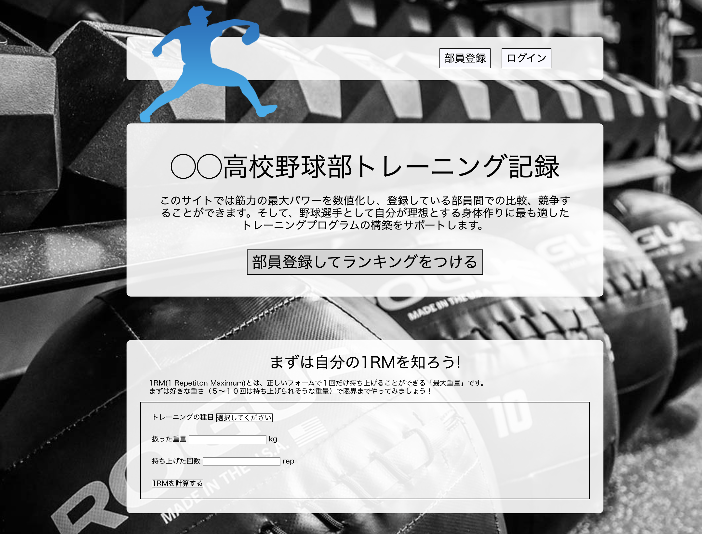
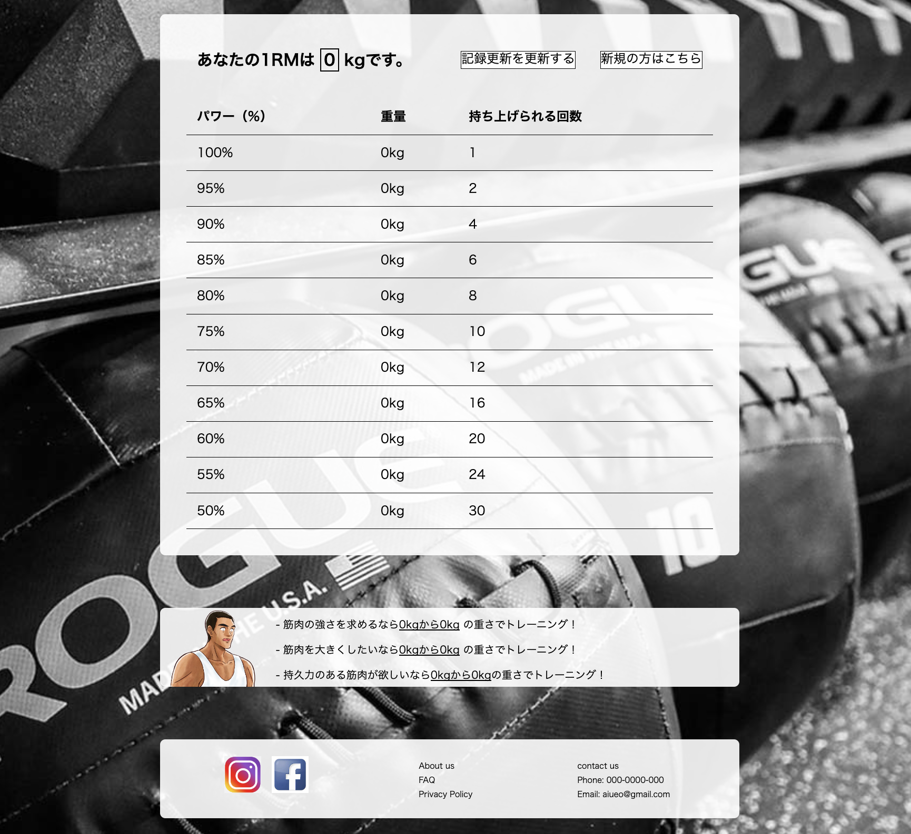

# ◯◯高校野球部トレーニング記録
# アプリケーション概要 
高校部活性向けのトレーニング記録サイトです。  
トレーニングのデータ（挙上回数、挙上重量）から最大重量を算出、投稿し、ユーザー間での順位を確認することができます。 
 
### メインページ

 

 
### ランキングページ

# 使用技術 
PHP 
MySQL 

# 機能一覧 
ユーザー登録機能 
ログイン機能 
記録登録機能 
ランキング機能 
最大挙上重量(1RM)計算機能 
